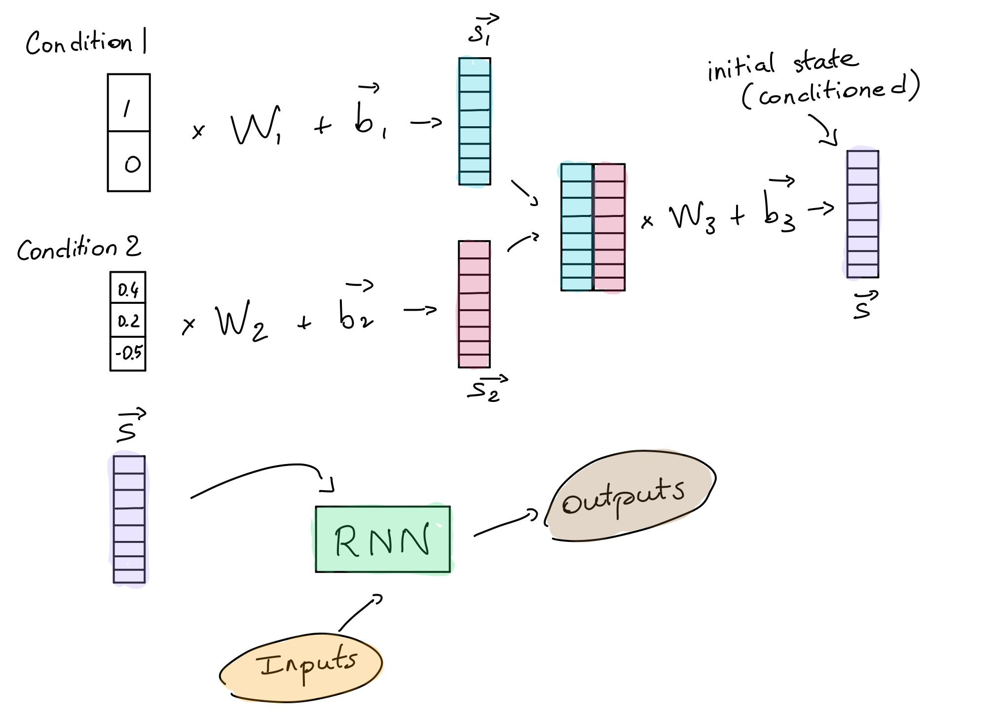

# Conditional RNN for Tensorflow/Keras

[](https://pepy.tech/project/cond-rnn)
[](https://pepy.tech/project/cond-rnn/month)


- Conditions time series predictions on time-invariant data. 
- Conditional RNN is a fully compatible Keras wrapper which supports any recurrent layer. 
- Tested with all versions of Tensorflow (until 2.10, Sep 2022).

## Installation / PyPI

ConditionalRecurrent is on PyPI. You can also install it from the sources.

```
pip install cond-rnn
```

## What is Conditional RNN?

The `ConditionalRecurrent` layer is useful if you have time series data with external inputs that do not depend on time. Let's consider some weather data for two different cities: Paris and San Francisco. The aim is to predict the next temperature data point. Based on our knowledge, the weather behaves differently depending on the city. You can either:
- Combine the auxiliary features with the time series data (ugly!).
- Concatenate the auxiliary features with the output of the RNN layer. It's some kind of post-RNN adjustment since the RNN layer won't see this auxiliary info.
- Or just use this library! Long story short, we initialize the RNN states with a learned representation of the conditions (e.g. Paris or San Francisco). This way, you model *elegantly* `P(x_{t+1}|x_{0:t}, cond)`.

<p align="center">
  
</p>

## API

This Keras wrapper `ConditionalRecurrent` initiates the internal states of recurrent layers with conditions given as separate inputs. It can be used with any recurrent layer supported by Keras and supports wrappers like `Bidirectional`.

### Arguments

- **layer**: a `tf.keras.layers.Layer` instance (`LSTM`, `GRU` or `SimpleRNN`...).

### Call arguments

- **inputs**: `3-D` Tensor with shape `[batch_size, timesteps, input_dim]`.
- **inputs_cond**: `2-D` Tensor or list of tensors with shape `[batch_size, cond_dim]`. In the case of a list, the tensors can have a different `cond_dim`.
- **training**: Python boolean indicating whether the layer should behave in training mode or in inference mode. This argument is passed to the wrapped layer.

### Raises

*AssertionError*: If not initialized with a `tf.keras.layers.Layer` instance.

## Example

```python
from tensorflow.keras import Input
from tensorflow.keras.layers import LSTM

from cond_rnn import ConditionalRecurrent

time_steps, input_dim, output_dim, batch_size, cond_size = 128, 6, 12, 32, 5
inputs = Input(batch_input_shape=(batch_size, time_steps, input_dim))
cond_inputs = Input(batch_input_shape=(batch_size, cond_size))

outputs = ConditionalRecurrent(LSTM(units=output_dim))([inputs, cond_inputs])
print(outputs.shape)  # (batch_size, output_dim)
```

You can also have a look at a real world example to see how `ConditionalRecurrent` performs: [here](examples/temperature).

## A bit more background...

This implementation was inspired from the very good answer: [Adding Features To Time Series Model LSTM](https://datascience.stackexchange.com/a/17139), which I quote below. The option 3 was implemented in this library (with a slight modification: we do not add 𝑣⃗ to the hidden state but rather overwrite the hidden state by 𝑣⃗. We can argue that this is almost exactly the same thing as 𝑣⃗ is obtained 𝑣⃗ =𝐖𝑥⃗ +𝑏⃗ where 𝑏⃗ could be the hidden state).

For RNNs (e.g., LSTMs and GRUs), the layer input is a list of timesteps, and each timestep is a feature tensor. That means that you could have a input tensor like this (in Pythonic notation):

```
# Input tensor to RNN
[
    # Timestep 1
    [ temperature_in_paris, value_of_nasdaq, unemployment_rate ],
    # Timestep 2
    [ temperature_in_paris, value_of_nasdaq, unemployment_rate ],
    # Timestep 3
    [ temperature_in_paris, value_of_nasdaq, unemployment_rate ],
    ...
]
```

So absolutely, you can have multiple features at each timestep. In my mind, weather is a time series feature: where I live, it happens to be a function of time. So it would be quite reasonable to encode weather information as one of your features in each timestep (with an appropriate encoding, like cloudy=0, sunny=1, etc.).

If you have non-time-series data, then it doesn't really make sense to pass it through the LSTM, though. Maybe the LSTM will work anyway, but even if it does, it will probably come at the cost of higher loss / lower accuracy per training time.

Alternatively, you can introduce this sort of "extra" information into your model outside of the LSTM by means of additional layers. You might have a data flow like this:

```
TIME_SERIES_INPUT ------> LSTM -------\
                                       *---> MERGE ---> [more processing]
AUXILIARY_INPUTS --> [do something] --/
```

So you would merge your auxiliary inputs into the LSTM outputs, and continue your network from there. Now your model is simply multi-input.

For example, let's say that in your particular application, you only keep the last output of the LSTM output sequence. Let's say that it is a vector of length 10. You auxiliary input might be your encoded weather (so a scalar). Your merge layer could simply append the auxiliary weather information onto the end of the LSTM output vector to produce a single vector of length 11. But you don't need to just keep the last LSTM output timestep: if the LSTM outputted 100 timesteps, each with a 10-vector of features, you could still tack on your auxiliary weather information, resulting in 100 timesteps, each consisting of a vector of 11 datapoints.

The Keras documentation on its functional API has a good overview of this.

In other cases, you may want to condition the LSTM on non-temporal data. For example, predict the weather tomorrow, given location. In this case, here are three suggestions, each with positive/negatives:

1. Have the first timestep contain your conditioning data, since it will effectively "set" the internal/hidden state of your RNN. Frankly, I would not do this, for a bunch of reasons: your conditioning data needs to be the same shape as the rest of your features, makes it harder to create stateful RNNs (in terms of being really careful to track how you feed data into the network), the network may "forget" the conditioning data with enough time (e.g., long training sequences, or long prediction sequences), etc.

2. Include the data as part of the temporal data itself. So each feature vector at a particular timestep includes "mostly" time-series data, but then has the conditioning data appended to the end of each feature vector. Will the network learn to recognize this? Probably, but even then, you are creating a harder learning task by polluting the sequence data with non-sequential information. So I would also discourage this.

3. Probably the best approach would be to directly affect the hidden state of the RNN at time zero. This is the approach taken by Karpathy and Fei-Fei and by Vinyals et al. This is how it works:

    * For each training sample, take your condition variables 𝑥⃗ .
    * Transform/reshape your condition variables with an affine transformation to get it into the right shape as the internal state of the RNN: 𝑣⃗ =𝐖𝑥⃗ +𝑏⃗  (these 𝐖 and 𝑏⃗  are trainable weights). You can obtain it with a Dense layer in keras.
    * For the very first timestep, add 𝑣⃗  to the hidden state of the RNN when calculating its value.
This approach is the most "theoretically" correct, since it properly conditions the RNN on your non-temporal inputs, naturally solves the shape problem, and also avoids polluting your inputs timesteps with additional, non-temporal information. The downside is that this approach often requires graph-level control of your architecture, so if you are using a higher-level abstraction like Keras, you will find it hard to implement unless you add your own layer type.

## Citation

```
@misc{CondRNN,
  author = {Philippe Remy},
  title = {Conditional RNN for Keras},
  year = {2020},
  publisher = {GitHub},
  journal = {GitHub repository},
  howpublished = {\url{https://github.com/philipperemy/cond_rnn}},
}
```

## FAQ

- [Why not merge conditions in only one vector?](https://github.com/philipperemy/cond_rnn/issues/3)

## References

- https://adventuresinmachinelearning.com/recurrent-neural-networks-lstm-tutorial-tensorflow
- https://datascience.stackexchange.com/a/17139
